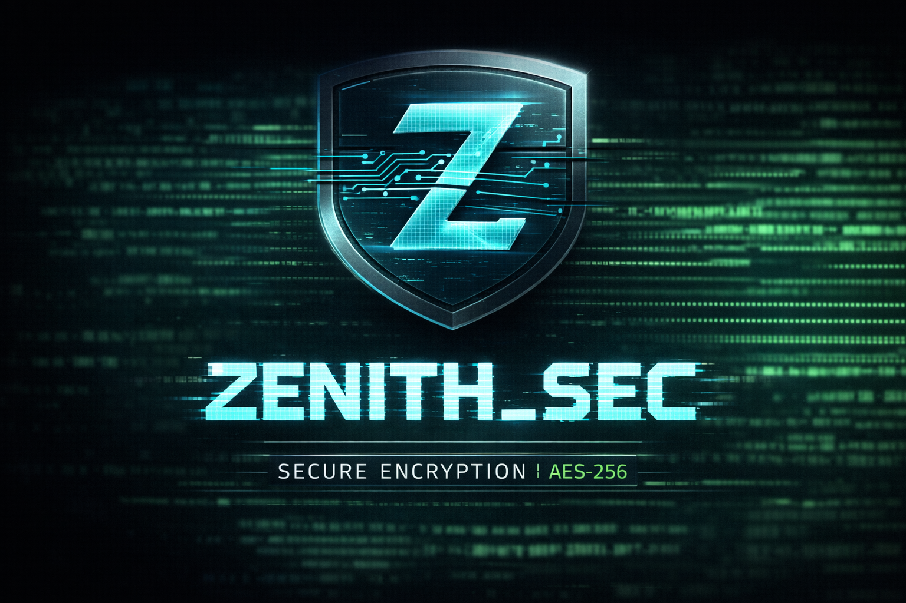

# 🛡️ ZENITH_SEC | Secure Encryption Terminal v2.0

  

> All UI elements are designed to mimic a professional terminal environment with interactive output and copy-to-clipboard functionality.


**ZENITH_SEC** is a modern, hacker-style, web-based encryption terminal built with **HTML, CSS, and JavaScript**, designed for **secure message encryption and decryption** directly in the browser.  

It combines **cyberpunk-inspired aesthetics**, **client-side cryptography**, and a **terminal-like interactive experience** for developers, students, and tech enthusiasts.

---

## 🚀 Key Features

- 🔐 **AES-256 / RC4 / TripleDES / Rabbit Encryption & Decryption**  
- 🖥️ **Terminal-style User Interface** with responsive design  
- 🔑 **Real-time Password Strength Indicator**  
- 📜 **Session Vault** for storing encrypted activity logs  
- 🎨 **Mobile-Friendly & Responsive Layout**  
- ⚡ **Fast Client-Side Processing** — no backend required  
- 🌗 **Dark / Light Theme Toggle**  
- 🧮 **Hash Generator** (MD5, SHA-1, SHA-256, SHA-512)  
- 🔑 **Secure Key Generator** with configurable length and charset  

---

## 🧠 How It Works


### Encryption
1. Enter a message and a secret key.
2. Encrypt using AES-256 (or other selected algorithms).  
3. Encrypted text appears in the terminal output and can be copied.

### Decryption
1. Paste encrypted text in the terminal.  
2. Enter the correct key.  
3. Original message is decrypted and displayed instantly.

> All operations occur **locally in the browser** — **no data is sent to a server**.

---

## 🛠️ Technologies Used

- **HTML5** – Semantic structure and layout  
- **CSS3** – Cyberpunk-style terminal UI, responsive design  
- **JavaScript (Vanilla)** – Encryption, decryption, UI interactions  
- **CryptoJS** – AES, RC4, 3DES, Rabbit encryption algorithms  

---

## 📂 Project Structure


```

ZENITH_SEC/
│
├── index.html # Main application structure
├── style.css # Terminal UI styling
├── script.js # Encryption logic & functionality
├── assets/ # Screenshots / logos 
└── README.md # Project documentation

```

---

## 🔒 Security Notice

- **Client-Side Encryption Only** — suitable for demonstration and educational purposes.  
- Does **not replace enterprise-grade encryption solutions**.  
- Keys and messages remain in the browser memory; no server communication.

---

## 🎯 Use Cases

- Secure message exchange (personal or educational)  
- Cryptography learning and experimentation  
- Hackathon and portfolio showcase  
- Demonstrating UI/UX for cybersecurity tools  

---

## 📦 Installation & Usage

1. Clone the repository:

```bash

git clone https://github.com/your-username/zenith-sec.git

```

2. Open `index.html` in your browser.

No server setup required.

---

## 👨‍💻 Author

Developed by [Moamen El-Sayed Abouhaty]

---

## 📜 License

This project is open-source and available under the MIT License.