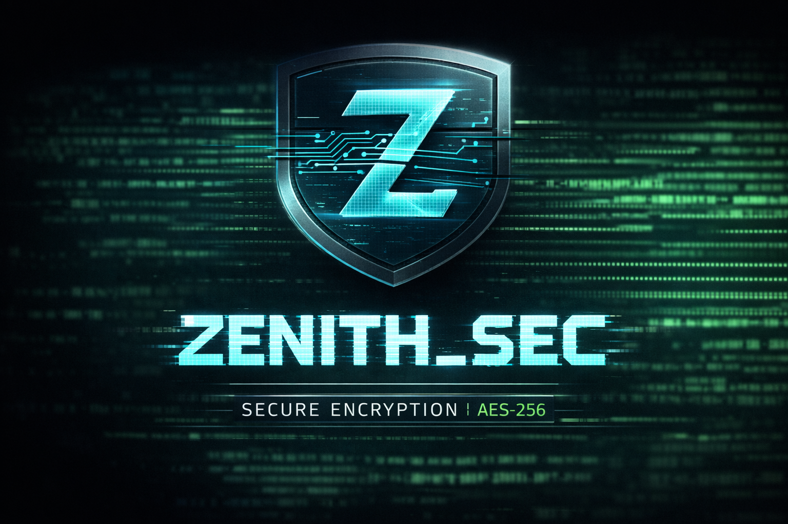

# ZENITH_SEC — Secure Terminal v2.0



> Client-side encryption workstation. Zero server contact.

## 📁 Structure

```
zenith_sec/
├── index.html
├── style.css
├── script.js
└── assets/
    └── demo.png
```

## ❗ Problem

Modern teams rely heavily on cloud platforms to store and share sensitive data.

This introduces critical risks:
- Data breaches and leaks
- Third-party access and surveillance
- Lack of control over data lifecycle

## 💡 Solution

ZENITH_SEC eliminates these risks by providing a fully offline, client-side secure workspace where:

- Data is encrypted before it exists
- No server is ever involved
- Users retain complete ownership and control

## ✨ Features

- 🔐 AES-256 / RC4 / 3DES / Rabbit encryption
- 🔑 Key generator with entropy stats
- 📊 Algorithm benchmark
- 📡 Morse / Binary / Hex / ROT13 / Base64 converter
- 📷 QR code generator & 💣 Self-destruct messages
- 🔢 Hash generator (MD5, SHA-1, SHA-256, SHA-512)
- 🎨 6 themes — Cyber, Hacker, Blood, Purple, Ocean, Ghost
- 👤 Local-only login/register system
- 📱 Fully responsive

## 🚀 Usage

```bash
open index.html
# or
python -m http.server 8080
```

## 🛠️ Libraries

- CryptoJS 4.1.1 — Encryption & hashing
- QRCode.js 1.0.0 — QR generation